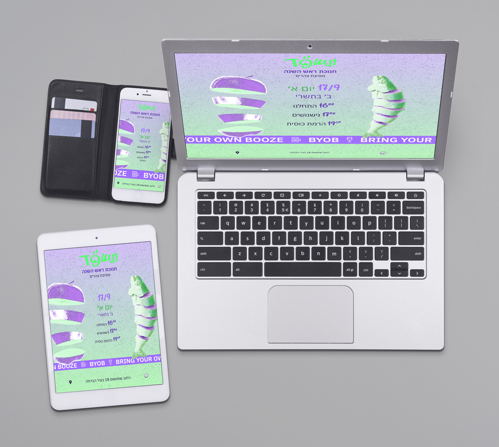

# Event Invitation – One Page Responsive Site

A responsive one-page website for an event invitation, featuring:

- Mobile, tablet, and desktop layout support  
- Live event schedule section  
- Continuous ticker animation with text and icons  
- Navigation links to Waze and Google Maps  
- Deployed via Netlify

[🔗 Live Demo](https://jazzy-sprinkles-936bb3.netlify.app/)

---

### ✨ Design Note

The design choices — layout, type, and visuals — aim for clarity, simplicity, and an eye-catching experience across devices.

---

### 🛠️ Built With

- HTML
- CSS (vanilla)
- JavaScript (vanilla)
- Netlify (deployment)

---

### 📂 Folder Structure

event_invitation/
├── index.html
├── styles.css
├── ticker.js
├── preview_screenshot.jpg
├── README.md
├── src/
│ ├── fish.png
│ ├── apple.png
│ ├── tshpd.svg
│ ├── 1drink.svg
│ ├── 2drink.svg
│ ├── 3drink.svg
│ ├── 4drink.svg
│ ├── 1600.svg
│ ├── 1700.svg
│ ├── 179.svg
│ ├── 1930.svg
│ ├── waze.svg
│ └── location.svg

---

### 📬 Feedback / Suggestions

Feel free to fork and modify.

